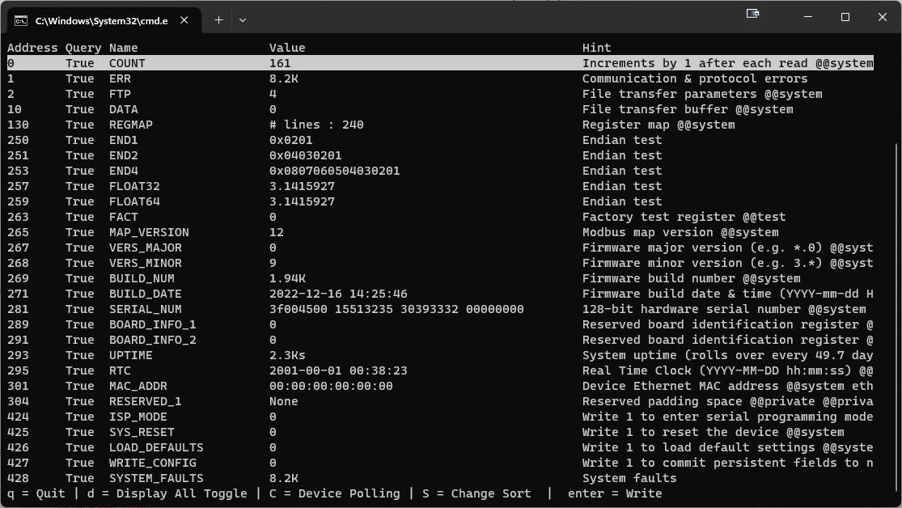

# Getting Started with 2G Modbus Devices

With this guide you'll quickly:

1. Launch **JAMBUI** for a quick start view of your device.
2. Integrate 2G auto-registermaps into your own application.
3. Explore sample scripts for Python, Web, and CLI demos.

## Using JAMBUI

Use JAMBUI to explore 2G devices and their register map.

**1. Download & Install**  
- Visit: https://www.2g-eng.com/subsea-products/product-support/  
- Download the latest JAMBUI installer (Windows/macOS/Linux).  
- Run the installer or unzip the package.

**2. Launch**  
- On Windows: double-click **JAMBUI.exe**  
- On macOS/Linux: run `jambui` from your applications menu or shell.

**3. Connect to Your 2G Device**  
1. Switch to the **Setup** tab.  
2. Under **Communication**, set port parameters:  
   - **Serial**: COM/tty port, baud rate, parity, stop bits, unit ID  
   - **TCP**: IP address, port, unit ID  
3. Click **Connect**.  
4. JAMBUI will automatically display the register map from the 2G device.

Explore jambui's help menu for additional usage information.

## Modbus Background and 2G's Regmap

Before you go further, make sure you are familiar with the Modbus protocol:
[https://www.modbus.org/docs/Modbus\_Application\_Protocol\_V1\_1b3.pdf](https://www.modbus.org/docs/Modbus_Application_Protocol_V1_1b3.pdf)

Integrating Modbus devices into modern systems can be time-consuming. Numeric register addresses, mixed-size fields, and custom packing introduce errors and slow development. Developers often spend hours hunting down register definitions and writing glue code to translate raw bytes into meaningful engineering values.

2G's **Regmap** streams a UUID-tagged, self-describing CSV map via register 130. It details names, types, scales, and packing so you can:

* Read and write registers by name
* Cache maps on reconnect
* Focus on your application, not low-level parsing

## Host

2G's Modbus protocol lets your host application download the device's register map on startup. On subsequent connections, a UUID check lets you reuse a cached map and speed up initialization.

**Code examples**:

* `jambapi.py`

### Connection Setup

1. Open a serial or TCP socket link to the device, specifying port settings (baud rate, parity, stop bits, unit ID).
2. Once the port is open, you're ready to issue Modbus requests.

### Reading Register 130 (`REGMAP`)

#### Map transfer

1. Write the ASCII text `-1` into holding register 130. This resets the REGMAP read pointer.
2. Repeatedly read a 120-word block from register 130.
3. Split the returned string on null (`\0`) bytes to recover line breaks.
4. When a read returns an empty first line, the transfer is complete.

#### Header parsing

* Lines beginning with `# title :` name the device.
* Lines beginning with `# uuid  :` contain a unique identifier that you'll use for caching.

## Register-Map Format

Each non-comment line in the CSV map has these comma-separated fields:

1. **Register address** (decimal)
2. **Words to read** (word count)
3. **Words to write** (word count)
4. **Persist flag** (`0` or `1`)
5. **Register name** (string)
6. **Packing specifier** (endianness + type + optional scale/offset)
7. **Unit** (e.g. `V`, `A`)
8. **Print format** (e.g. `"{value:.2f}"`)
9. **Hint/description/tag**

Example line:

```csv
42,2,2,0,TEMPERATURE,>f,C,"{value:.1f}","Temperature reading@sensor"
```

## Accessing Registers by Name

### Read

1. Look up the register entry by its name.
2. Send a **Modbus Read Holding Registers** request using the register's address and word count.
3. Concatenate the returned 16-bit words into a byte stream.
4. Unpack the bytes according to the packing specifier.
5. Apply scale and offset to compute the final value.

### Write

1. Look up the register entry by its name.
2. Send a **Modbus Write** request with the appropriately packed bytes.

## Cached Map

Caching the CSV map locally greatly speeds up reconnects. Your client should:

1. While downloading the map, parse the header's UUID.
2. If a local file named `<UUID>.csv` exists, load that instead of streaming.
3. Otherwise, perform the live download and save it as `<UUID>.csv`.
4. Parse the loaded CSV into your in-memory register table.

---

# Usage of Example Code Files

## `jambapi.py`

* Connects to serial devices, reads map, reads/writes registers
* Less than 500 lines of code
* If device has a UUID, the API will use or save a map cache CSV
* Key functions:

  * `read_regmap_from_device()`: Reads the register map from 2G devices and auto-switches to cached map when UUID is detected
  * `portay()`: Formats register values for display

## `jambweb.py`

* Demo of a web interface using the API
* Files used:

  * `jambweb.py`
  * `jambweb_template.html`
  * `jambapi.py`

## `jambmon.py`

* Demo of a command-line interface using the API
* Less than 300 lines of code
* Screenshot preview below
* Files used:

  * `jambmon.py`
  * `jambapi.py`



## `mb_map_read_standalone.py`

* Connects to a serial or USB 2G Modbus device and saves the register map to `registerMap.csv`
